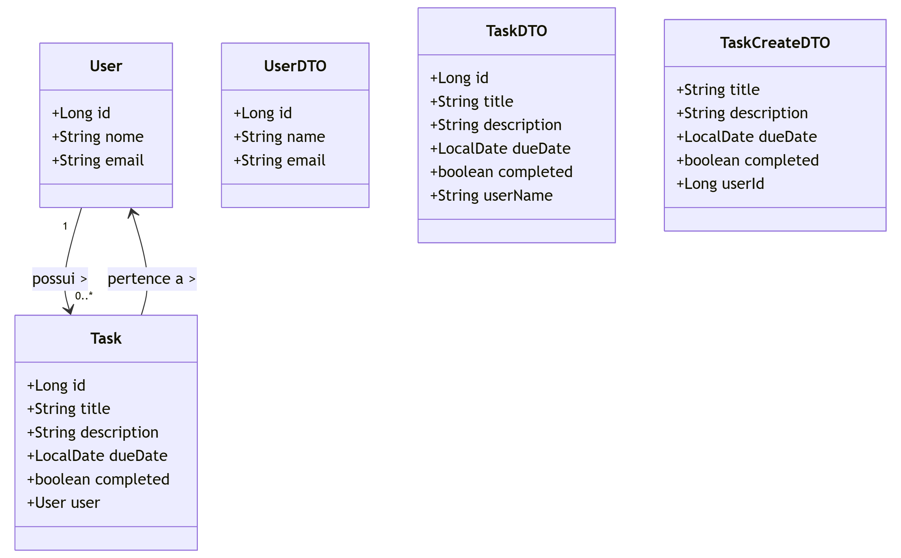

# 📝 Task Manager API

Projeto Java Spring Boot que simula uma API de gerenciamento de tarefas, com associação entre tarefas e usuários.

---

## 🔗 Diagrama de Classes

---

## 🔧 Tecnologias Utilizadas
- Java 21
- Spring Boot
- Spring Data JPA
- H2 Database (banco de dados em memória)
- Lombok

---

## 📁 Estrutura do Projeto
- **User**: representa o usuário do sistema.
- **Task**: representa uma tarefa vinculada a um usuário.
- **DTOs e Services**: organizam a lógica de negócio.
- **Controllers**: expõem as rotas REST para acesso à API.

---

## 📮**Endpoints Disponíveis**

### 👤 Usuários

GET /users → Listar todos os usuários

GET /users/{id} → Buscar usuário por ID

POST /users → Criar novo usuário

### ✅ Tarefas

GET /tasks → Listar todas as tarefas

GET /tasks/{id} → Buscar tarefa por ID

POST /tasks → Criar nova tarefa

DELETE /tasks/{id} → Deletar tarefa por ID

---

## ✅ Status do Projeto
#### ✅ Funcional
#### 🔒 Segurança e testes automatizados a implementar (próximas etapas)

---

## 🙋 Autor

**Victor da Costa Almada**

📍 Gravataí - RS

📧 victor_mather@hotmail.com

💼 LinkedIn -> https://www.linkedin.com/in/victor-almada/
